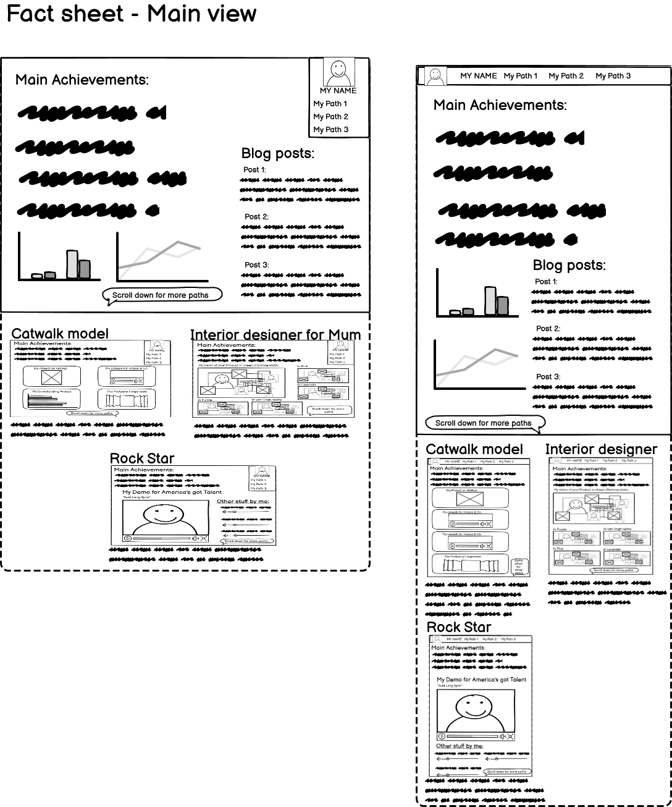
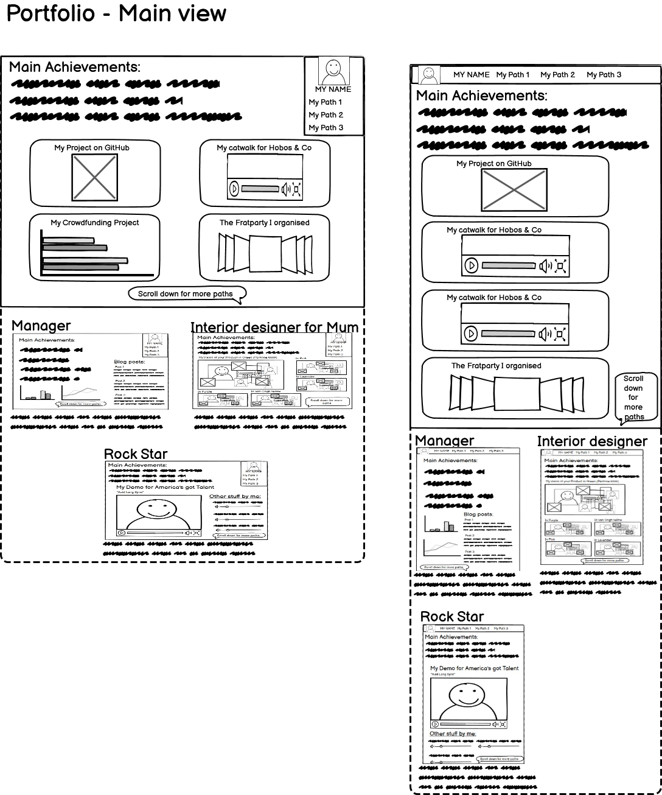
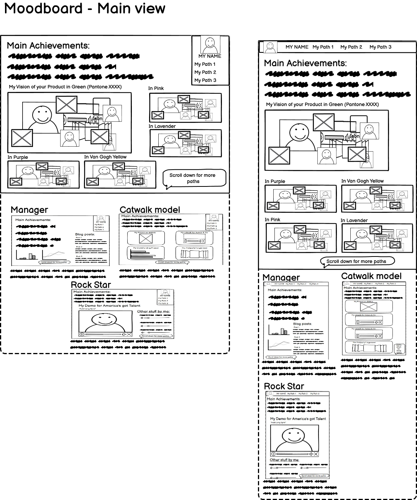
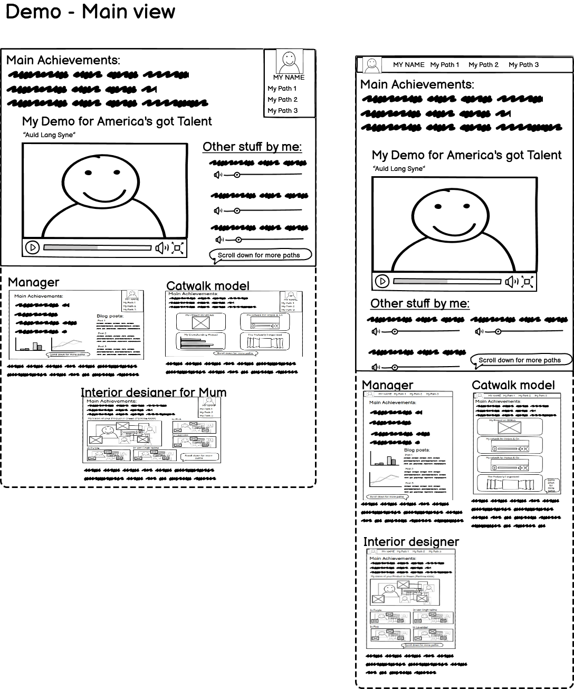
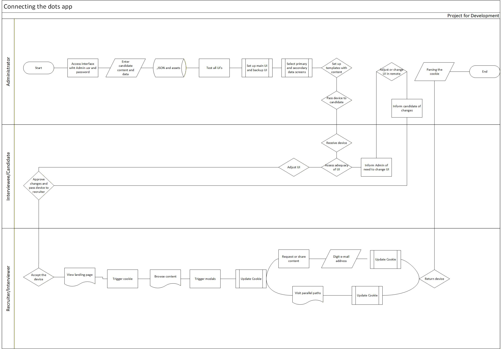

# "Connecting the Dots"

## INTRODUCTION

This Project is born from real life situation: I was looking at a job ad regarding Websites content manager for a hotel chain, and I found myself in front of a conundrum about my less than orthodox career path - combining hotel sales managment, artistic endeavours and development. I made my considerations and concluded that there was no way that I would manage to make any recruiter believe in me if they saw a résumé with all that missmatched information. 

When struggling with the conundrum, I thought that should I manage to get the first interview, at any critical point I could take out my tablet and let the interviewer browse a single screen presentation in html with different contents: information of curriculum vitae, GitHub repositories, moodboards of my marketing vision, even artistic demos. This would offer them a well mapped path to see the ways I could become an asset for them, by letting them choose the elements of interest. In a nutshell, let them connect the dots to their convenience.

To not become a one-off thing, the interface should be adaptable to different position applied (since the experience would always remain the same) and adjustable in a couple of inconspicuous moves after reading the room. 

After thinking the idea further, I considered that the connection might even be a three-way communication if behind the lead for the job were an impresario or an agent. Let's take as example the situation where an impesario sends a performing artist for an audition with a producer.

The impresario probably knows the producer better than the artist does, and knows what the producer is expecting to see and which kind of content could make a difference between their client and others. The impresario also knows their artist, what aspect of the experience to pitch and which ones to hide.

Instead of providing a hardcopy portfolio to the artist to complement the audition, the impresario can set up a single screen presentation, picking the content to display as well as the possible parallel, secondary path which may be of interest in the specific production. For instance an actor could have had a previous experience as dancer or on the catwalk, which might be an asset for the production. An Only-Fans profile for foot fetish could instead be something to brush under the carpet in that production.

The UI of the presentation has a number of preset options depending of the concrete situation of the audition - a creative general mood might invite for a unicorn-based theme, whereas if the circumstances were tense, the artist possibly would want to discreetly change the theme.

In this case the user would theoretically be 3: the impresario - Admin, the artist - the interviewee and the producer - the interviewer or end user. The support should be mandatorily chosen and approved by the Admin, and preferably have a touchscreen to avoid messing up with displays, keyboards and mice. The information provided should be succinct and not lag due to the need of connection to a database.

The end product by connecting the dots and heterogeneous content would be a portable portfolio/demo/moodboard. 

## User stories

### As a recruiter:

* As an interviewer, I wish to be able to browse the candidates personality, without passing for nosy to understand who I really have in front of me, to hire the right person.
* As an interviewer, I want to be able get sidetracked from the strict job profile description given to me and go out of the box, to show my superiors that I’m capable of audacious decisions.
* As a bored recruiter, I want to be distracted from my boring routines, to have a moment of fantasy.
* As a serious recruiter, I want to receive inspiring short information to the point in my exploration, of this candidates soul to not feel guilty for allowing myself this moment of distraction.

#### As the candidate

* As the interviewee, I want the UI of the app be attractive and bespoke to the moment of the interview after reading the room, to ensure that the interviewer should not decline to look at the demo.
* As candidate, I want the demo to take initiative if the interviewer stays stuck for too long a while.

### As the administrator

* As the administrator, I want to be able to set up different UI’s which can be changed in a swipe by the candidate to react after reading the room.
* As the administrator, I want to be able to choose a layout for the presentation, to make the maximum impact with the easiest access.
* As the administrator, I want to be able to select the content segment to feature in the presentation, to answer the requests of the recruiter
* As the administrator, I want to be able to pick the information and content to be included in the segment, to only .
* As the administrator, I want to be able to trace the breadcrumbs left by the recruiter, to gather insights about the questions raised by the presence of the candidate and the interests of the interview for a forthcoming other candidate or for the second interview of this candidate.
* As administrator, I want to be able to record the comments of the interviewer, without him realising that I’m doing it, to analyse their comments, their voice and tone.
* As the administrator, I want to be able to video record the face of the interviewee when they watch the demo.

## UX and UI

The user experience is expected to be highly different, whether the user is Admin or interviewee/interviewee. 

The interviewee's intervention is expected to be merely accessory: if necessary, quick-adjust the UI for the interviewer and hand over the device.

The device should preferably be a portable handheld device with a touch-screen. The end-use, i.e. the interviewer's actions are limited to standard browsing gesture and possibly bookmarking or sharing content.

The administrator however will do the lionshare of the setting up of the device, using most of the features.

### Interviewer UI

The purpose of the application is to offer a fitting visual interface to the end-user - i.e. in this case the interviewer/recruiter.

The only distracting element of the interface is the cookie menu asking whether the user wants to use accessible features.

The choice of assets should be preset to what is expected by the administrator. Should the situation of the interview be dramatically different from the expected, the candidate may quickly adjust it to something more adequate or neutral on the index page.

Each preset will also be available in accessible, with large fonts, high contrast and enhanced alt/aria features.

The landing screen will preferably be with the minimum of unnecessary, distracting graphic elements, apart from a small profile picture of the candidate/interviewee.

The recruiter's landing pages are each separate pages with a different template depending of the content.

The pages should be responsive to the recruiter's instinct to look at it in landscape or portrait, to their convenience. Even if use on a laptop or a desktop computer can be considered, the presentation on mobile phone is not recommended.

#### Wireframes for content related templates

The main landing screen of each content has easy access to the out of the box career path connections. A discreet link at the top of the page allows access to the content, whereas scrolling down the page will provide thumbnails of the pages as well as a brief description.

##### Fact-sheet template

##### Portfolio template

##### Moodboard template

##### Demo template

### Interviewee UI

The access and quick changes interface is the only feature used by the interviewee. It's located on the index page.

Since the application is online, the quick changes of interface can also be done from another device than the one the recruiter will be using, and could even be done in remote by the Admin. For this purpose, the index as well as the Admin interface should be responsive also on mobile phone displays.

### Administrator UI

The administrator should check all the preset views both in the normal and the accessible set up.

### General UX 

#### Flowchart User's journey

[Download this flowchart in pdf](assets/media/rm_fc_flowchart_connecting_the_dots.pdf)

#### Admin UX

##### Content assets upload

The Admin can upload the necessary assets using a form, which validates the type of asset uploaded and indexes the information in a json file located in the same folder as the assets.

## Instructions for end users

### Set up by the admin

### Quick adjustment by the interviewee

### Interviewer

## Development

### GitHub profiles

Due to occasional issues with the IDE on my Desktop computer, I have used my secondary GitHub profile, PedroSv-bit for most of the development. The main repository is hosted on my Code Institute related profile.

## Deployment

## Technologies

- Balsamiq for Wireframes
- MS Visio for Flowcharts
- HTML
- CSS
- node.js
- MS Copilot - deep thinking